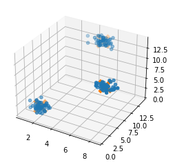

```python
import numpy as np
import pandas as pd
from sklearn.cluster import MeanShift
from sklearn.datasets import make_blobs
import matplotlib.pyplot as plt
from mpl_toolkits.mplot3d import Axes3D
```


```python
clusters=[[2,2,2],[7,7,7],[5,13,13]]
```


```python
X,_=make_blobs(n_samples=150,centers=clusters,cluster_std=0.60)
```


```python
ms=MeanShift()
ms.fit(X)
cluster_centers=ms.cluster_centers_
```


```python
fig=plt.figure()
ax=fig.add_subplot(111,projection='3d')
ax.scatter(X[:,0],X[:,1],X[:,2],marker='o')
ax.scatter(cluster_centers[:,0],cluster_centers_[:,1],cluster_centers_[:,2],marker='x',s=300,linewidth=5,zorder=10)
plt.show()
```





```python

```


```python

```
